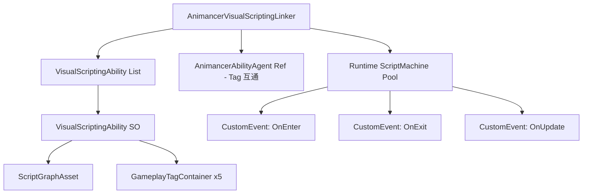

## 产品概述

创建一套 Visual Scripting 与 AnimancerAbility 系统集成的机制，允许用户使用 Unity Visual Scripting（ScriptGraphAsset）编写逻辑脚本并关联到 AnimancerAbility 的 GameplayTag 系统中，实现与行为树技能并行的可视化脚本技能扩展。

## 核心功能

1. **VisualScriptingAbility 数据资产（ScriptableObject）**

- 引用一个 Unity Visual Scripting 的 ScriptGraphAsset
- 包含与 AnimancerAbility 相同的 GameplayTag 字段（AbilityTags、CancelAbilitiesWithTag、BlockAbilitiesWithTag、ActiveTags、RequiredTags）
- 编辑器中可使用现有 GameplayTag 系统选择标签

2. **AnimancerVisualScriptingLinker 组件（MonoBehaviour）**

- 类似 AnimancerAbilityLinker 的桥接组件，挂载到角色上
- 管理一组 VisualScriptingAbility 资产
- 支持通过名称手动调用 OnEnter / OnExit / OnUpdate
- 与 AnimancerAbilityAgent 的 Tag 系统互通（共享 ActiveTags、BlockAbilitiesWithTag）
- 支持分组管理（不需要运行时 Clone）

3. **创建菜单**

- 在 "Assets/Create/AnimancerSkillSystem/" 菜单下新增 "Visual Scripting Ability" 创建选项
- 创建时自动生成 ScriptGraphAsset 并内置 OnEnter、OnExit、OnUpdate 三个 Custom Event 根节点

4. **手动调用接口**

- AnimancerVisualScriptingLinker 提供 TriggerOnEnter / TriggerOnExit / TriggerOnUpdate 公开方法
- 通过 Unity Visual Scripting 的 CustomEvent.Trigger 机制触发 ScriptGraph 中对应的自定义事件节点

## 技术栈

- Unity 2022+ / C#
- Unity Visual Scripting 1.8.0（com.unity.visualscripting）
- Unity Editor（IMGUI / UIToolkit PropertyDrawer）
- Taco.Gameplay.GameplayTagContainer（现有 Tag 系统）
- AnimancerAbility / AnimancerAbilityAgent（现有技能框架）

## 实现方案

### 整体策略

创建三个核心文件：

1. `VisualScriptingAbility.cs` — ScriptableObject 数据资产，持有 ScriptGraphAsset 引用 + GameplayTag 字段
2. `AnimancerVisualScriptingLinker.cs` — MonoBehaviour 桥接组件，管理 VisualScriptingAbility 列表，通过 ScriptMachine 执行图
3. `AnimancerVisualScriptingLinkerEditor.cs` — 自定义 Inspector

### 关键技术决策

1. **ScriptGraph 执行方式**：使用 `ScriptMachine`（动态挂载或角色上预挂载）结合 `CustomEvent.Trigger(gameObject, "OnEnter")` 触发事件。每个 VisualScriptingAbility 对应一个运行时的 ScriptMachine 实例，通过切换 `graph` 属性或独立 GameObject 实现隔离。

2. **与 AnimancerAbilityAgent 的 Tag 集成**：AnimancerVisualScriptingLinker 持有对同 GameObject 上 AnimancerAbilityLinker 的引用（可选），启动/停止 VisualScriptingAbility 时，向 AnimancerAbilityAgent 的 ActiveTags 添加/移除标签，并遵守 BlockAbilitiesWithTag 和 RequiredTags 规则。

3. **ScriptGraphAsset 创建**：编辑器菜单创建时，生成一个空的 ScriptGraphAsset (.asset)，并通过 Visual Scripting API 预置三个 CustomEvent 节点（OnEnter / OnExit / OnUpdate），用户打开后即可在这三个事件节点后编写逻辑。

4. **运行时架构**：为每个活跃的 VisualScriptingAbility 在角色下创建子 GameObject 并附加 ScriptMachine，ScriptMachine.graph 设置为对应的 ScriptGraphAsset。通过 Variables 将角色引用等上下文传入图中。

### 性能考量

- ScriptMachine 仅在 Ability 激活时创建/启用，非激活时禁用以避免 Update 开销
- 不做 Clone/Instantiate 操作，ScriptMachine 通过子 GameObject 隔离天然支持多实例

## 实现细节

### VisualScriptingAbility 数据结构

```
[CreateAssetMenu]
public class VisualScriptingAbility : ScriptableObject
{
    public ScriptGraphAsset ScriptGraph;
    
    // 与 AnimancerAbility 相同的 GameplayTag 系统
    public GameplayTagContainer AbilityTags;
    public GameplayTagContainer CancelAbilitiesWithTag;
    public GameplayTagContainer BlockAbilitiesWithTag;
    public GameplayTagContainer ActiveTags;
    public GameplayTagContainer RequiredTags;
}
```

### AnimancerVisualScriptingLinker 运行时流程

- `Start()`: 遍历配置的 VisualScriptingAbility 列表，为每个创建子 ScriptMachine（disabled），设置 graph
- `TriggerOnEnter(name)`: 找到对应的 ScriptMachine，启用并触发 "OnEnter" 自定义事件
- `TriggerOnUpdate(name, deltaTime)`: 触发 "OnUpdate" 自定义事件
- `TriggerOnExit(name)`: 触发 "OnExit" 自定义事件，然后禁用 ScriptMachine
- Tag 逻辑：启动时检查 RequiredTags / BlockAbilitiesWithTag，添加 ActiveTags

## 架构设计



## 目录结构

```
TestAnim/Assets/TimelineSkill/Core/VisualScripting/
├── VisualScriptingAbility.cs              # [NEW] ScriptableObject 数据资产。持有 ScriptGraphAsset 引用和5个 GameplayTagContainer 字段（AbilityTags/CancelAbilitiesWithTag/BlockAbilitiesWithTag/ActiveTags/RequiredTags）。含 UNITY_EDITOR 区域的 MenuItem 创建逻辑，创建时自动生成 ScriptGraphAsset 并预置 OnEnter/OnExit/OnUpdate 三个 CustomEvent 节点。
├── AnimancerVisualScriptingLinker.cs      # [NEW] MonoBehaviour 桥接组件。管理 VisualScriptingAbility 分组列表，运行时为每个 ability 创建子 ScriptMachine，提供 TriggerOnEnter/TriggerOnExit/TriggerOnUpdate 公开方法通过 CustomEvent.Trigger 执行图逻辑。支持与 AnimancerAbilityAgent 的 Tag 互通、激活/停用管理（不做 Clone）。
└── Editor/
    └── AnimancerVisualScriptingLinkerEditor.cs  # [NEW] 自定义 Inspector。绘制 VisualScriptingAbility 分组列表（仿照 AnimancerAbilityLinkerEditor 的 Category 模式）、显示当前激活状态。
```

## Agent Extensions

### SubAgent

- **code-explorer**
- Purpose: 在实现 ScriptGraphAsset 创建逻辑时，搜索 Unity Visual Scripting 1.8.0 的 API（如 GraphSource, FlowGraph, CustomEvent 节点类型名），确认正确的命名空间和类型路径
- Expected outcome: 确认 ScriptGraphAsset 编辑器创建、CustomEvent 节点 API 的准确使用方式

### Skill

- **animancer-skill-designer**
- Purpose: 确保 VisualScriptingAbility 的 GameplayTag 配置与现有 AnimancerAbility 的 Tag 系统完全兼容，Tag 互通逻辑正确
- Expected outcome: Tag 阻塞/取消/缓冲逻辑在 VisualScriptingAbility 和 AnimancerAbility 之间正确互操作