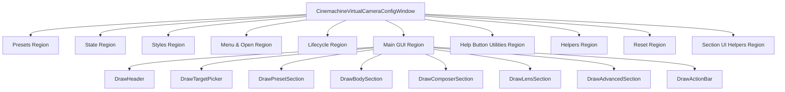

## 用户需求

创建一个新的 Unity EditorWindow，用于配置 CinemachineVirtualCamera 参数，UI 风格和架构完全仿照现有的 `CinemachineFreeLookConfigWindow`。

## 产品概述

一个 CinemachineVirtualCamera 专用的配置工具窗口，提供多种游戏类型预设一键配置能力。用户选中场景中的 VirtualCamera 后，可通过预设按钮快速应用适合不同游戏类型的参数组合，也可逐个调整 Body（Transposer）、Aim（Composer）、Lens 等参数。所有参数旁均附带 `?` 帮助按钮，点击可查看详细说明。

## 核心功能

- 游戏类型预设一键配置（至少 6 种），必须包含：RTS/策略俯视、俯视角动作(ARPG/暗黑类)、第三人称动作、第三人称射击(TPS 越肩)、横版/2.5D、电影镜头
- Body（CinemachineTransposer）参数编辑：Follow Offset (x,y,z)、XYZ Damping、Binding Mode
- Aim（CinemachineComposer）参数编辑：Horizontal/Vertical Damping、Dead Zone、Screen X/Y、Soft Zone
- Lens 参数编辑：FOV、Near Clip、Far Clip
- 所有参数带 `?` 帮助按钮，弹出 DisplayDialog 详细说明
- 自动识别场景选中的 VirtualCamera 对象
- 支持 Undo/Redo
- Reset to Default 重置功能

## 技术栈

- Unity Editor GUI (IMGUI)
- C# / EditorWindow
- Cinemachine 2.10.7 (com.unity.cinemachine@2.10.7)
- SerializedObject / SerializedProperty 体系

## 实现方案

### 整体策略

完全仿照 `CinemachineFreeLookConfigWindow` 的架构模式创建新的 `CinemachineVirtualCameraConfigWindow`，复用 BeginSection/EndSection、DrawPropertyWithHelp、帮助文本字典等设计模式。核心差异：VirtualCamera 无子 Rig，Body/Aim 组件通过 `m_ComponentPipeline` 数组访问。

### 关键技术决策

1. **组件访问方式**：VirtualCamera 的 Body(CinemachineTransposer) 和 Aim(CinemachineComposer) 存储在 `CinemachineComponentBase[]` 数组中，通过 `GetCinemachineComponent<T>()` 获取运行时引用，通过 SerializedObject 包装后操作属性。

2. **预设结构体**：设计 `VCamPreset` 结构体，包含 Body Offset、Body Damping、Binding Mode（枚举序号）、Composer 参数、Lens 参数。预设需要覆盖 RTS 高俯视（Offset=(0,30,-5), FOV=60, BindingMode=WorldSpace）和 ARPG 45度俯视（Offset=(0,12,-8), FOV=50）等典型配置。

3. **Binding Mode 处理**：Cinemachine 2.x 中 Transposer 的 `m_BindingMode` 是枚举（LockToTargetOnAssign=0, LockToTargetWithWorldUp=1, LockToTarget=2, WorldSpace=3, SimpleFollowWithWorldUp=4），预设中用 int 存储。

4. **窗口菜单**：`Tools/Cinemachine/VirtualCamera Config Tool`，优先级 202（紧跟 FreeLook 的 201）。

### 性能考量

- SerializedObject 在 OnGUI 每帧 UpdateIfDirtyOrScript 确保数据同步，无额外开销
- 帮助文本字典为 static readonly，一次性分配

## 实现细节

- 复用 FreeLookConfigWindow 的 Section UI 模式（BeginSection/EndSection）
- 复用 DrawPropertyWithHelp 模式（属性字段 + ? 按钮 + DisplayDialog）
- 对 Body/Aim 组件分别创建 SerializedObject 以支持 Undo
- Undo.RecordObject 覆盖 VirtualCamera 自身 + Body 组件 + Aim 组件
- 编译时自动关闭窗口避免序列化问题

## 架构设计



## 目录结构

```
TestAnim/Assets/TimelineSkill/KCC/Editor/
└── CinemachineVirtualCameraConfigWindow.cs  # [NEW] CinemachineVirtualCamera 配置工具 EditorWindow。包含 VCamPreset 预设结构体（6种游戏类型含RTS/俯视角），Body/Composer/Lens 各 Section 参数编辑，所有参数带 ? 帮助按钮，支持 Undo，整体架构仿照 FreeLookConfigWindow。
```

## 关键代码结构

```
/// <summary>VirtualCamera 游戏类型预设</summary>
public struct VCamPreset
{
    public string Name;
    public string Description;
    public Color AccentColor;

    // Body (CinemachineTransposer)
    public Vector3 FollowOffset;      // m_FollowOffset
    public Vector3 Damping;           // m_XDamping, m_YDamping, m_ZDamping
    public int BindingMode;           // CinemachineTransposer.BindingMode enum ordinal

    // Aim (CinemachineComposer)
    public float HorizontalDamping;
    public float VerticalDamping;
    public float DeadZoneWidth;
    public float DeadZoneHeight;
    public float ScreenX;
    public float ScreenY;
    public float SoftZoneWidth;
    public float SoftZoneHeight;

    // Lens
    public float FOV;
    public float NearClip;
    public float FarClip;
}
```

## Agent Extensions

### SubAgent

- **code-explorer**
- Purpose: 在实现过程中查找 Cinemachine 2.10.7 中 CinemachineTransposer 的序列化属性路径，确认 m_FollowOffset、m_XDamping 等字段名
- Expected outcome: 确认所有需要访问的 SerializedProperty 路径准确无误