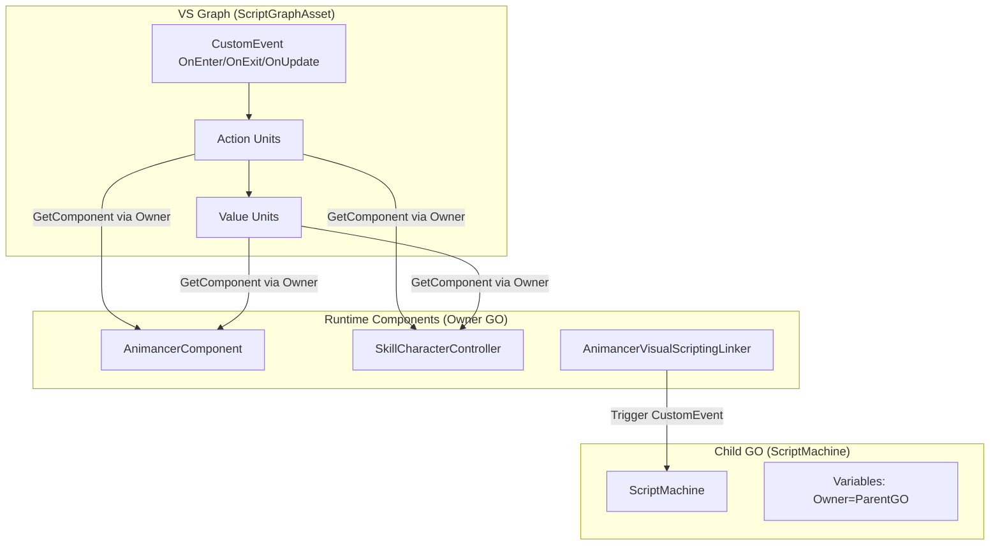

## Product Overview

为 AnimancerAbility 系统的所有 ActionNode 和 ValueNode 创建对应的 Unity Visual Scripting Unit 节点，使 VisualScriptingAbility 的 ScriptGraph 能够实现与树节点相同的功能——播放动画、控制角色移动、锁定输入、检测状态等。

## Core Features

- **动画播放 Unit**: PlayAnimancerTimeline、PlayAnimancerTranslate、StopAnimancer —— 在 VS Graph 中播放/停止 Animancer 动画
- **动画事件 Unit**: AnimancerStateEvent —— 绑定动画结束或指定时间点的回调，触发后续执行流
- **Animator 参数 Unit**: SetAnimatorFloat/Int/Bool/Trigger —— 设置 Animator Controller 参数
- **角色运动 Unit**: SetMoveSpeed —— 设置地面/空中移动速度
- **输入锁定 Unit**: SetInputLock、RemoveInputLock、ClearAllInputLocks —— 技能施法期间锁定/解除输入
- **状态获取 Unit**: GetAnimancerState、InputKeyCondition、IsMoving、IsInAir、IsGrounded、IsGroundMoving、GetMoveInput —— 获取动画状态和角色状态值
- **Ability 条件 Unit**: AnimancerAbilityCanStart —— VS 版本的启动条件判断
- **Ability 取消 Unit**: OnAnimancerAbilityCancel —— VS 版本的 Ability 被取消时事件入口

## Tech Stack

- Unity Visual Scripting (`Unity.VisualScripting` 命名空间)
- Animancer (`AnimancerComponent`, `AnimancerState`, `TransitionAssetBase`)
- EasyCharacterMovement / KinematicCharacterController (`SkillCharacterController`)
- Unity Input System (`InputActionReference`)
- C# / Unity 2021+

## Implementation Approach

### 策略

为每个树节点创建一个继承自 `Unity.VisualScripting.Unit` 的 VS Unit 类。Action 类节点使用 ControlInput/ControlOutput（执行流）模式，Value 类节点使用纯 ValueOutput（数据流）模式。

所有 Unit 通过 ScriptMachine 所在 GameObject 的父级（Owner）获取 `AnimancerComponent` 和 `SkillCharacterController`，利用 `AnimancerVisualScriptingLinker` 注册时设置的 "Owner" 变量获取角色 GameObject。

### 关键技术决策

1. **获取组件的方式**: 通过 `Variables.Object(flow.stack.gameObject)` 获取 "Owner" GameObject，再 GetComponent 获取 AnimancerComponent / SkillCharacterController，避免依赖特定层级结构
2. **Action Unit 模式**: 使用 `ControlInput` 作为触发入口，执行逻辑后通过 `ControlOutput` 传递执行流。对于异步操作（如 PlayAnimancerTranslate 的 OnEnd 模式），使用 Coroutine 或手动回调模式
3. **Value Unit 模式**: 纯 `ValueOutput` + `ValueInput`，无执行流，每次拉取时计算值
4. **异步完成模式**: AnimancerStateEvent / PlayAnimation 的 CompletionMode.OnEnd 使用 VS 的协程支持（`ControlOutput` 在回调中触发），通过 `flow.StartCoroutine` 或事件回调机制实现
5. **UnitCategory 统一为**: `"AnimancerAbility"` 下分 Action/Value/Condition 子类别

### 基类设计

创建一个 `VSAbilityUnitBase` 抽象基类，封装获取 Owner GameObject → AnimancerComponent / SkillCharacterController 的通用逻辑，避免每个 Unit 重复编写。

## Implementation Notes

### 获取组件的模式

```
Owner GO = Variables.Object(flow.stack.gameObject).Get("Owner") as GameObject
AnimancerComponent = Owner.GetComponent<AnimancerComponent>()
SkillCharacterController = Owner.GetComponent<SkillCharacterController>()  // using UnityTimeline namespace
```

### 性能注意

- ValueUnit 每次被拉取都会调用 GetComponent，应缓存到 flow.stack 的 GraphReference 级别
- 但 VS 的 Unit 是无状态的，需要通过 `flow.GetValue<T>()` 每帧获取。为避免每帧 GetComponent，可使用 `graph.GetRuntimeData` 或简单的 `GetComponent` 模式（Unity 内部已有缓存机制）

### 向后兼容

- 不修改现有 AnimancerVisualScriptingLinker 或 VisualScriptingAbility 代码
- 新增文件均在 Units/ 子目录，不影响已有 Graph 资产

## Architecture Design

### 模块关系



## Directory Structure

```
TestAnim/Assets/TimelineSkill/Core/VisualScripting/
├── Units/
│   ├── Base/
│   │   └── VSAbilityUnitBase.cs         # [NEW] 所有 VS Ability Unit 的抽象基类。封装从 ScriptMachine 子对象获取 Owner GameObject、AnimancerComponent、SkillCharacterController 的通用逻辑。提供 GetOwner(Flow)、GetAnimancer(Flow)、GetSkillController(Flow) 辅助方法。
│   ├── Action/
│   │   ├── PlayAnimancerTimelineUnit.cs  # [NEW] 播放 Timeline TransitionAsset。输入: TransitionAsset(面板)、FadeDuration、BindSignal、CompletionMode(面板)。输出: AnimancerState、执行流(Done)。OnStart模式立即传递，OnEnd模式等待动画结束后触发Done输出。
│   │   ├── PlayAnimancerTranslateUnit.cs # [NEW] 播放动画 TransitionAsset。输入: TransitionAsset(面板)、FadeDuration、Speed、CompletionMode(面板)。输出: AnimancerState、执行流(Done)。
│   │   ├── StopAnimancerUnit.cs          # [NEW] 停止 Animancer 播放。无数据输入输出，仅执行流 In→Out。
│   │   ├── AnimancerStateEventUnit.cs    # [NEW] 绑定 AnimancerState 事件。输入: AnimancerState、EventType(面板)、NormalizedTime。有两个 ControlOutput: 一个即时通过(Out)，一个事件触发时(OnEvent)。
│   │   ├── SetAnimatorFloatUnit.cs       # [NEW] 设置 Animator Float 参数。输入: AnimancerState、Key(string)、Value(float)。执行流 In→Out。
│   │   ├── SetAnimatorIntUnit.cs         # [NEW] 设置 Animator Int 参数。输入: AnimancerState、Key(string)、Value(int)。执行流 In→Out。
│   │   ├── SetAnimatorBoolUnit.cs        # [NEW] 设置 Animator Bool 参数。输入: AnimancerState、Key(string)、Value(bool)。执行流 In→Out。
│   │   ├── SetAnimatorTriggerUnit.cs     # [NEW] 触发 Animator Trigger。输入: AnimancerState、Key(string)。执行流 In→Out。
│   │   ├── SetMoveSpeedUnit.cs           # [NEW] 设置角色移动速度。输入: GroundSpeed(float,-1不修改)、AirSpeed(float,-1不修改)。执行流 In→Out。
│   │   ├── SetInputLockUnit.cs           # [NEW] 添加输入锁定。输入: LockKey(string)、LockFlags(InputLockFlags枚举)。执行流 In→Out。
│   │   ├── RemoveInputLockUnit.cs        # [NEW] 移除输入锁定。输入: LockKey(string)、LockFlags(InputLockFlags)。执行流 In→Out。
│   │   └── ClearAllInputLocksUnit.cs     # [NEW] 清除所有输入锁定。无数据输入，执行流 In→Out。
│   ├── Value/
│   │   ├── GetAnimancerStateUnit.cs      # [NEW] 按 Key 获取 AnimancerState。输入: Key(string)。输出: AnimancerState(object)。
│   │   ├── InputKeyConditionUnit.cs      # [NEW] 检测 InputAction 是否按下。面板: InputActionReference。输出: IsPressed(bool)。
│   │   ├── IsMovingUnit.cs               # [NEW] 检测角色是否移动。面板: SpeedThreshold(float)。输出: IsMoving(bool)。
│   │   ├── IsInAirUnit.cs                # [NEW] 检测角色是否在空中。输出: IsInAir(bool)。
│   │   ├── IsGroundedUnit.cs             # [NEW] 检测角色是否在地面。输出: IsGrounded(bool)。
│   │   ├── IsGroundMovingUnit.cs         # [NEW] 检测角色是否地面移动。面板: SpeedThreshold。输出: IsGroundMoving(bool)。
│   │   └── GetMoveInputUnit.cs           # [NEW] 获取移动输入和局部方向。输出: MoveInput(Vector2)、LocalMoveDir(Vector2)。
│   └── Special/
│       ├── AbilityCanStartUnit.cs        # [NEW] VS版Ability启动条件。ValueInput: Condition(bool)。作为Graph中的条件检查节点，AnimancerVisualScriptingLinker在TryStart时调用。
│       └── OnAbilityCancelUnit.cs        # [NEW] VS版Ability被取消事件。EventUnit模式，当Ability被Cancel时触发执行流，输出被取消的AbilityName。
├── AnimancerVisualScriptingLinker.cs     # [MODIFY] 微调：在TryStartAbility中调用AbilityCanStart条件检查（如果Graph中存在该Unit）
├── VisualScriptingAbility.cs             # [NO CHANGE]
└── Editor/
    └── AnimancerVisualScriptingLinkerEditor.cs  # [NO CHANGE]
```

## Key Code Structures

```
/// <summary>
/// 所有 VS Ability Unit 的基类，提供获取 Owner 组件的通用方法
/// </summary>
public abstract class VSAbilityUnitBase : Unit
{
    /// <summary>从 flow 中获取 Owner GameObject（通过 Variables 中的 "Owner" 变量）</summary>
    protected GameObject GetOwner(Flow flow);
    
    /// <summary>从 Owner 获取 AnimancerComponent</summary>
    protected AnimancerComponent GetAnimancer(Flow flow);
    
    /// <summary>从 Owner 获取 SkillCharacterController</summary>
    protected SkillCharacterController GetSkillController(Flow flow);
    
    /// <summary>从 Owner 获取 AnimancerVisualScriptingLinker</summary>
    protected AnimancerVisualScriptingLinker GetLinker(Flow flow);
}
```

## Agent Extensions

### Skill

- **animancer-skill-designer**
- Purpose: 在实现各个 VS Unit 节点时参考 AnimancerAbility 技能节点的设计模式，确保功能对等
- Expected outcome: 每个 VS Unit 的输入输出、执行逻辑与原始树节点完全一致

### SubAgent

- **code-explorer**
- Purpose: 在实现过程中需要查找 SkillCharacterController 的具体 API（如 Motor、MoveAction、OrientationReference 等），以及 Unity Visual Scripting 的 Unit 编写规范
- Expected outcome: 准确获取组件 API 签名，确保 VS Unit 调用正确的方法